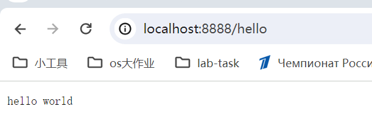

# 技术栈

1. 字节开源HTTP框架 -  hertz
2. IDL - protobuf  / Apache Thrift
3. 代码生成工具 - cwgo
   1. [protobuf文档](https://protobuf.dev/programming-guides/proto3/)


# 开发流程

## 1. 新建项目

```shell
go mod init github.com/hourhl/Qmall
go get -u github.com/cloudwego/hertz

# 快速启动框架
mkdir hello-world
cd hello-world
new-item hello-world.go
# 粘贴文档中的快速启动示例代码
# 修改一下h.GET的逻辑
# 根目录下运行
cd ..
go mod tidy
cd hello-world
go run hello-world.go
```



附：修改一下h.GET的逻辑如下

```go
h.GET("/hello", func(ctx context.Context, c *app.RequestContext) {
		c.Data(consts.StatusOK, consts.MIMETextPlain, []byte("hello world"))
	})s
```

* 设置远程仓库

  ```shell
  git remote add origin https://github.com/hourhl/Qmall.git
  # 由于本地分支是master，考虑到github默认分支是main，运行以下指令进行分支切换
  # git branch main
  # git checkout main
  git add .
  git commit -m "start hertz with hello world and copy protobuf file in idl/"
  git pull origin main --allow-unrelated-histories
  git push -u origin main
  ```

  

## 2. 接口

* 新建idl文件夹，从项目方案中copy对应的接口文档（finish）
* 利用 cwgo生成代码（参照github或文档安装protosql和cwgo）