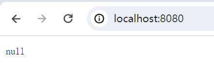
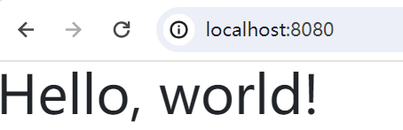
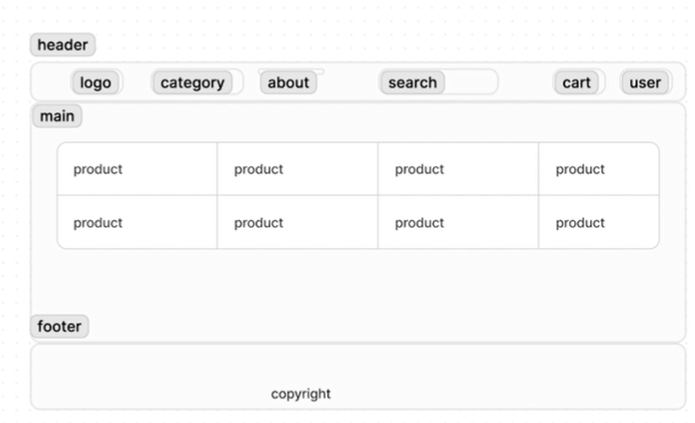

# 技术栈

1. 字节开源HTTP框架 -  hertz
2. IDL - protobuf  / Apache Thrift
3. 代码生成工具 - cwgo
   1. [protobuf文档](https://protobuf.dev/programming-guides/proto3/)
4. 服务注册软件 - Kitex
5. 注册中心 - consul


---

# 开发流程

## 1. 新建项目

```shell
go mod init github.com/hourhl/Qmall
go get -u github.com/cloudwego/hertz

# 快速启动框架
mkdir hello-world
cd hello-world
new-item hello-world.go
# 粘贴文档中的快速启动示例代码
# 修改一下h.GET的逻辑
# 根目录下运行
cd ..
go mod tidy
cd hello-world
go run hello-world.go
```


附：修改一下h.GET的逻辑如下

```go
h.GET("/hello", func(ctx context.Context, c *app.RequestContext) {
		c.Data(consts.StatusOK, consts.MIMETextPlain, []byte("hello world"))
	})s
```

* 设置远程仓库

  ```shell
  git remote add origin https://github.com/hourhl/Qmall.git
  # 由于本地分支是master，考虑到github默认分支是main，运行以下指令进行分支切换
  # git branch main
  # git checkout main
  git add .
  git commit -m "start hertz with hello world and copy protobuf file in idl/"
  git pull origin main --allow-unrelated-histories
  git push -u origin main
  ```

  

## 2. 接口

* 新建idl文件夹，从项目方案中copy对应的接口文档（finish）

* 利用 cwgo生成代码

  ```shell
  # Windows Powershell配置goproxy
  # 启用 Go Modules 功能
  $env:GO111MODULE="on"
  # 配置 GOPROXY 环境变量
  $env:GOPROXY="https://goproxy.io"
  
  # 安装cwgo
  # 注意：gcc和g++必须是64位才能编译成功
  go install github.com/cloudwego/cwgo@latest
  cwgo --version
  cwgo version v0.1.2
  
  
  # 安装protoc
  # github下载安装包并解压，添加环境变量bin文件夹
  protoc --version
  libprotoc 28.3
  
  # 生成代码
  mkdir src
  cd src
  # 生成的命令如下：不确定
  cwgo server -i ../idl --type RPC --module github.com/hourhl/Qmall/src --service mall --idl ../idl/*
  
  go mod tidy
  go work use .
  got run 
  ```


---

## 3. 前端开发

### 技术栈

1. 框架 - 本次项目的演示页面几乎不使用js，基本只使用html和css
2. 库- UI组件（bootstrap） /  图形库（Fontawesome）
3. 页面骨架 - go template

### 开发步骤

1. 利用hertz生成代码

   1. 参照hertz usage proto，在idl文件夹下放置api.proto,在idl/frontend文件夹下放置home.proto

      ```shell
      cd .\app\frontend\
      cwgo server --type HTTP --idl ..\..\idl\frontend\home.proto --service frontend -module github.com/hourhl/Qmall/app/frontend -I ..\..\idl\
      ```
      
   2. 确认代码能够运行
   
      ```shell
      go mod tidy
      go run .
      ```
   
      
   
2. 修改代码 - 读取模板文件[参考文档](https://www.cloudwego.cn/docs/hertz/tutorials/basic-feature/render/)

   ```shell
   # main.go - func:main
   # h.Spin()前加上
   h.LoadHTMLGlob("template/*")
   
   # app/frontend文件夹下新建template文件夹
   # 新建home.tmpl文件
   # 随便写点什么
   this is home
   
   # app/frontend/biz/handler/home
   # 修改home_service.go，让其加载模板home.tmpl
   # 注释 utils.SendSuccessResponse(ctx, c, consts.StatusOK, resp)
   # 加上
   c.HTML(consts.StatusOK, "home.tmpl", resp)
   
   # 启动 go run .
   # 访问localhost:8080
   # 可以看到页面显示 this is home
   ```

3. 编写前端页面(bootstrap)

   1. 引入框架 - [下载](https://getbootstrap.com/docs/5.3/getting-started/download/)编译好的文件，并加载到项目中

      ```shell
      # app/frontend下新建文件夹static
      # static中再分别新建css和js文件夹
      # 解压下载的文件，将bootstrap.min.css拷贝到css下，将bootstrap.bundle.min.js拷贝到js下
      ```

   2. 指定静态目录 - [参考文档](https://getbootstrap.com/docs/5.3/getting-started/introduction/)引入css和js到home.tmpl中

      ```shell
      # home.tmpl
      # 修改bootstrap.min.css和bootstrap.bundle.min.js的引入路径
      
      # main.go - func:main
      # h.Spin()前加上
      h.Static("/static", "./")
      # 用于引入静态目录
      
      # 确认框架启动成功
      go run .
      ```

      

   3. 页面设计

      

   4. 导航栏（header）

      ```shell
      # copy bootstrap的navbar导航栏，并进行修改
      # 利用fontawesome来引入图标 参考文档 https://fontawesome.com/docs
      ```
      
   5. footer
   
   6. main
   
   7. template分隔
   
   8. 动态渲染 - 修改app/frontend/biz/service/home.go和app/frontend/biz/handler/home/home_service.go
   
      ```shell
      # 业务逻辑主要在service文件夹下实现
      ```
   
      


---

## 4. 后端开发


