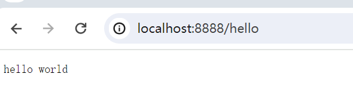

# 技术栈

1. 字节开源HTTP框架 -  hertz
2. IDL - protobuf  / Apache Thrift
3. 代码生成工具 - cwgo
   1. [protobuf文档](https://protobuf.dev/programming-guides/proto3/)
4. 服务注册软件 - Kitex
5. 注册中心 - consul


# 开发流程

## 1. 新建项目

```shell
go mod init github.com/hourhl/Qmall
go get -u github.com/cloudwego/hertz

# 快速启动框架
mkdir hello-world
cd hello-world
new-item hello-world.go
# 粘贴文档中的快速启动示例代码
# 修改一下h.GET的逻辑
# 根目录下运行
cd ..
go mod tidy
cd hello-world
go run hello-world.go
```



附：修改一下h.GET的逻辑如下

```go
h.GET("/hello", func(ctx context.Context, c *app.RequestContext) {
		c.Data(consts.StatusOK, consts.MIMETextPlain, []byte("hello world"))
	})s
```

* 设置远程仓库

  ```shell
  git remote add origin https://github.com/hourhl/Qmall.git
  # 由于本地分支是master，考虑到github默认分支是main，运行以下指令进行分支切换
  # git branch main
  # git checkout main
  git add .
  git commit -m "start hertz with hello world and copy protobuf file in idl/"
  git pull origin main --allow-unrelated-histories
  git push -u origin main
  ```

  

## 2. 接口

* 新建idl文件夹，从项目方案中copy对应的接口文档（finish）

* 利用 cwgo生成代码

  ```shell
  # Windows下配置goproxy
  # 启用 Go Modules 功能
  $env:GO111MODULE="on"
  # 配置 GOPROXY 环境变量
  $env:GOPROXY="https://goproxy.io"
  
  # 安装cwgo
  # 注意：gcc和g++必须是64位才能编译成功
  go install github.com/cloudwego/cwgo@latest
  cwgo --version
  cwgo version v0.1.2
  
  
  # 安装protoc
  # github下载安装包并解压，添加环境变量bin文件夹
  protoc --version
  libprotoc 28.3
  
  # 生成代码
  mkdir src
  cd src
  # 生成的命令如下：不确定
  cwgo server -i ../idl --type RPC --module github.com/hourhl/Qmall/src --service mall --idl ../idl/*
  
  go mod tidy
  go work use .
  got run 
  ```


## 3. 前端开发

### 技术栈

1. 框架 - 本次项目的演示页面几乎不使用js，基本只使用html和css
2. 库- UI组件（bootstrap） /  图形库（Fontawesome）
3. 页面骨架 - go template

### 开发逻辑

1. 利用hertz生成代码

   1. 参照hertz usage proto，在idl文件夹下放置api.proto,在idl/frontend文件夹下放置home.proto

      ```shell
      cwgo server --type HTTP --idl .\idl\frontend\home.proto --service frontend -module github.com/hourhl/Qmall/app/frontend -I .\idl\
      [ERROR]E:/GoPATH/pkg/mod/github.com/cloudwego/cwgo@v0.1.2/cwgo.go:47: module name given by the '-module' option ('github.com/hourhl/Qmall/app/frontend') is not consist with the name defined in go.mod ('github.com/hourhl/Qmall' from .)
      
      ```

      


 