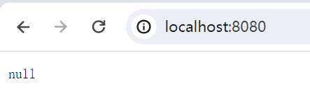
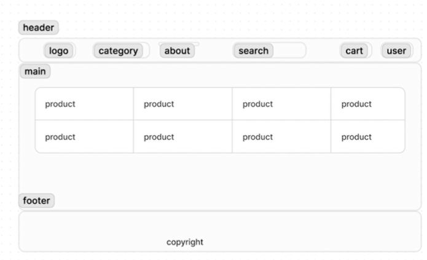

# 技术栈

1. 字节开源HTTP框架 -  hertz
2. 字节RPC框架 - Kitex
3. IDL - protobuf  / Apache Thrift
4. 代码生成工具 - cwgo
   1. [protobuf文档](https://protobuf.dev/programming-guides/proto3/)
5. 注册中心 - consul
6. 数据库 - mysql


---

# 开发流程

## 1. 新建项目

```shell
go mod init github.com/hourhl/Qmall
go get -u github.com/cloudwego/hertz

# 快速启动框架
mkdir hello-world
cd hello-world
new-item hello-world.go
# 粘贴文档中的快速启动示例代码
# 修改一下h.GET的逻辑
# 根目录下运行
cd ..
go mod tidy
cd hello-world
go run hello-world.go
```


附：修改一下h.GET的逻辑如下

```go
h.GET("/hello", func(ctx context.Context, c *app.RequestContext) {
		c.Data(consts.StatusOK, consts.MIMETextPlain, []byte("hello world"))
	})s
```

* 设置远程仓库

  ```shell
  git remote add origin https://github.com/hourhl/Qmall.git
  # 由于本地分支是master，考虑到github默认分支是main，运行以下指令进行分支切换
  # git branch main
  # git checkout main
  git add .
  git commit -m "start hertz with hello world and copy protobuf file in idl/"
  git pull origin main --allow-unrelated-histories
  git push -u origin main
  ```

  

## 2. 接口

* 新建idl文件夹，从项目方案中copy对应的接口文档（finish）

* 利用 cwgo生成代码

  ```shell
  # Windows Powershell配置goproxy
  # 启用 Go Modules 功能
  $env:GO111MODULE="on"
  # 配置 GOPROXY 环境变量
  $env:GOPROXY="https://goproxy.io"
  
  # 安装cwgo
  # 注意：gcc和g++必须是64位才能编译成功
  go install github.com/cloudwego/cwgo@latest
  cwgo --version
  cwgo version v0.1.2
  
  
  # 安装protoc
  # github下载安装包并解压，添加环境变量bin文件夹
  protoc --version
  libprotoc 28.3
  
  # 生成代码
  mkdir src
  cd src
  # 生成的命令如下：不确定
  cwgo server -i ../idl --type RPC --module github.com/hourhl/Qmall/src --service mall --idl ../idl/*
  
  go mod tidy
  go work use .
  got run 
  ```


---

## 3. 前端开发

### 技术栈

1. 框架 - 本次项目的演示页面几乎不使用js，基本只使用html和css
2. 库- UI组件（bootstrap） /  图形库（Fontawesome）
3. 页面骨架 - go template

### 开发步骤

1. 利用hertz生成代码

   1. 参照hertz usage proto，在idl文件夹下放置api.proto,在idl/frontend文件夹下放置home.proto

      ```shell
      cd .\app\frontend\
      cwgo server --type HTTP --idl ..\..\idl\frontend\home.proto --service frontend -module github.com/hourhl/Qmall/app/frontend -I ..\..\idl\
      ```
      
   2. 确认代码能够运行
   
      ```shell
      go mod tidy
      go run .
      ```
   
      
   
2. 修改代码 - 读取模板文件[参考文档](https://www.cloudwego.cn/docs/hertz/tutorials/basic-feature/render/)

   ```shell
   # main.go - func:main
   # h.Spin()前加上
   h.LoadHTMLGlob("template/*")
   
   # app/frontend文件夹下新建template文件夹
   # 新建home.tmpl文件
   # 随便写点什么
   this is home
   
   # app/frontend/biz/handler/home
   # 修改home_service.go，让其加载模板home.tmpl
   # 注释 utils.SendSuccessResponse(ctx, c, consts.StatusOK, resp)
   # 加上
   c.HTML(consts.StatusOK, "home.tmpl", resp)
   
   # 启动 go run .
   # 访问localhost:8080
   # 可以看到页面显示 this is home
   ```

3. 编写前端页面(bootstrap)

   1. 引入框架 - [下载](https://getbootstrap.com/docs/5.3/getting-started/download/)编译好的文件，并加载到项目中

      ```shell
      # app/frontend下新建文件夹static
      # static中再分别新建css和js文件夹
      # 解压下载的文件，将bootstrap.min.css拷贝到css下，将bootstrap.bundle.min.js拷贝到js下
      ```

   2. 指定静态目录 - [参考文档](https://getbootstrap.com/docs/5.3/getting-started/introduction/)引入css和js到home.tmpl中

      ```shell
      # home.tmpl
      # 修改bootstrap.min.css和bootstrap.bundle.min.js的引入路径
      
      # main.go - func:main
      # h.Spin()前加上
      h.Static("/static", "./")
      # 用于引入静态目录
      
      # 确认框架启动成功
      go run .
      ```

      

   3. 页面设计

      

   4. 导航栏（header）

      ```shell
      # copy bootstrap的navbar导航栏，并进行修改
      # 利用fontawesome来引入图标 参考文档 https://fontawesome.com/docs
      ```
      
   5. footer
   
   6. main
   
   7. template分隔
   
   8. 动态渲染 - 修改app/frontend/biz/service/home.go和app/frontend/biz/handler/home/home_service.go
   
      ```shell
      # 业务逻辑主要在service文件夹下实现
      ```
   
      


---


## 4. 后端开发

### 认证中心

#### 基本功能

1. 分发身份令牌
2. 校验身份令牌

#### 实现思路

cwgo生成代码 -> 修改controller -> 完善service -> 与数据库交互

[参考文档](https://www.cnblogs.com/YLTFY1998/p/16898513.html)


#### 开发步骤

1. 修改auth.proto

   ```protobuf
   syntax="proto3";
   
   package auth;
   
   option go_package="/auth";
   
   service AuthService {
     rpc DeliverTokenByRPC(DeliverTokenReq) returns (DeliveryResp) {}
     rpc VerifyTokenByRPC(VerifyTokenReq) returns (VerifyResp) {}
   }
   
   message DeliverTokenReq {
     int32  user_id= 1;
   }
   
   message VerifyTokenReq {
     string token = 1;
     int32 userId = 2;
   }
   
   message DeliveryResp {
     string token = 1;
   }
   
   message VerifyResp {
     bool res = 1;
   }
   ```
   
2. 利用cwgo分别生成客户端代码和服务端代码

   ```shell
   # Qmall根目录下新建一个rpc_gen文件夹，存放生成的客户端代码
   cd rpc_gen
   cwgo client --type RPC --service auth --module github.com/hourhl/Qmall/rpc_gen -I ..\idl\ --idl ..\idl\auth.proto
   
   # 生成服务端代码，并不再维护客户端代码
   cd app/auth
   # 新建一个模块
   go mod init github.com/hourhl/Qmall/app/auth
   cwgo server --type RPC --service auth --module github.com/hourhl/Qmall/app/auth --pass "-use github.com/hourhl/Qmall/rpc_gen/kitex_gen" -I ..\..\idl\ --idl ..\..\idl\auth.proto
   
   # 在服务端的go.mod中手动引入rpc_gen的路径
   github.com/hourhl/Qmall/rpc_gen => ../../rpc_gen
   
   go mod tidy
   ```

3. 引入jwt

   ```shell
   go get -u github.com/golang-jwt/jwt/v5
   ```
   
4. 定义user模型(app/user/biz/model/claim.go)

5. 服务注册[参考文档](https://www.cloudwego.io/zh/docs/kitex/tutorials/service-governance/service_discovery/consul/)

   ```shell
   # 引入组件
   go get github.com/kitex-contrib/registry-consul
   ```

6. 修改mysql的配置文件

   1. 修改/app/auth/biz/dal/mysql/init.go，因为这一部分不需要往数据库中写入数据，因此注释掉mysql和redis的初始化

   2. 修改/app/auth/conf/test/conf.yaml中mysql的dsn，并把registry的端口为8500，把kitex端口号改为8881，注释掉mysql和redis的配置信息，将文件内容复制到/app/auth/conf/dev/conf.yaml和/app/auth/conf/online/conf.yaml中

   3. 新建环境变量的配置文件 /app/auth/.env

   4. 加载环境变量配置文件 /app/auth/main.go

      ```go
      // main 函数首行加上
      godotenv.Load()
      ```

      ```shell
      # 加载包
            cd /app/auth
            go get github.com/joho/godotenv
            go mod tidy
      ```

7. 实现生成token和验证token的逻辑

   [参考文档](https://pkg.go.dev/github.com/golang-jwt/jwt/v5#example-NewWithClaims-CustomClaimsType)


---

### 用户服务

#### 基本功能

1. 创建用户（注册）
2. 登录
3. 获取用户身份信息


#### 实现思路

cwgo生成代码 -> 定义user模型 -> 完善service逻辑 -> 单元测试


#### 开发步骤

1. 修改user.proto

   在LoginResp中加入一个token字段，作为接下来进行token校验的

   ```shell
   syntax="proto3";
   
   package user;
   
   option go_package="/user";
   
   service UserService {
     rpc Register(RegisterReq) returns (RegisterResp) {}
     rpc Login(LoginReq) returns (LoginResp) {}
     rpc VerifyUser(VerifyUserReq) returns (VerifyUserResp){}
   }
   
   message RegisterReq {
     string email = 1;
     string password = 2;
     string confirm_password = 3;
   }
   
   message RegisterResp {
     int32 user_id = 1;
   }
   
   message LoginReq {
     string email= 1;
     string password = 2;
   }
   
   message LoginResp {
     string token = 1;
   }
   
   message VerifyUserReq {
     int32 user_id = 1;
     string token = 2;
   }
   
   message VerifyUserResp {
     bool res = 1;
   }
   ```

2. 利用cwgo分别生成服务端和客户端代码

   ```shell
   # Qmall根目录下新建一个rpc_gen文件夹，存放生成的客户端代码
   cd rpc_gen
   go mod init github.com/hourhl/Qmall/rpc_gen
   cwgo client --type RPC --service user --module github.com/hourhl/Qmall/rpc_gen -I ..\idl\ --idl ..\idl\user.proto
   
   # 生成服务端代码，并不再维护客户端代码
   cd app/user
   # 新建一个模块
   go mod init github.com/hourhl/Qmall/app/user
   cwgo server --type RPC --service user --module github.com/hourhl/Qmall/app/user --pass "-use github.com/hourhl/Qmall/rpc_gen/kitex_gen" -I ..\..\idl\ --idl ..\..\idl\user.proto
   
   # 在服务端的go.mod中手动引入rpc_gen的路径
   github.com/hourhl/Qmall/rpc_gen => ../../rpc_gen
   
   go mod tidy
   ```

3. 定义user模型(app/user/biz/model/user.go)

4. 服务注册[参考文档](https://www.cloudwego.io/zh/docs/kitex/tutorials/service-governance/service_discovery/consul/)

   ```shell
   # 引入组件
   go get github.com/kitex-contrib/registry-consul
   ```

5. 修改mysql的配置文件

   1. 修改/app/user/biz/dal/mysql/init.go，使其从环境变量中读取配置信息，并配置自动迁移

   2. 修改/app/user/conf/test/conf.yaml中mysql的dsn，并把registry的端口为8500，把kitex端口号改为8882，将文件内容复制到/app/user/conf/dev/conf.yaml和/app/user/conf/online/conf.yaml中

   3. 新建环境变量的配置文件 /app/user/.env

   4. 加载环境变量配置文件 /app/user/main.go

      ```go
      // main 函数首行加上
      godotenv.Load()
      ```
      
```shell
      # 加载包
      cd /app/user
      go get github.com/joho/godotenv
      go mod tidy
```

6. 实现注册逻辑

   1. 引入加密组件

      ```shell
      go get golang.org/x/crypto
      ```

   2. /app/user/biz/model定义用户模型，并定义和往数据库中插入用户信息的函数

   3. /app/user/biz/service实现用户逻辑

   4. 单元测试

      1. 将/app/user/biz/dal/mysql/init.go中的dsn的路径从读取配置文件改为直接路径

      2. 启动docker

      3. 启动user模块

      4. 手动在register_test.go加载环境变量和初始化mysql，运行TestRegister_Run函数

         

7. 实现登录逻辑

   1. 基本逻辑同注册
   2. 利用auth模块获得token(todo)
   3. 单元测试(todo)


---

### 商品服务

#### 基本功能

* 查询商品信息（单个商品、批量商品）

#### 实现思路

 生成代码 -> 定义模型 -> 实现业务逻辑 -> 单元测试

#### 开发步骤

1. product.proto定义接口

   ```protobuf
   syntax = "proto3";
   
   package product;
   
   option go_package = "/product";
   
   service ProductCatalogService {
     rpc ListProducts(ListProductsReq) returns (ListProductsResp) {}
     rpc GetProduct(GetProductReq) returns (GetProductResp) {}
     rpc SearchProducts(SearchProductsReq) returns (SearchProductsResp) {}
   }
   
   message ListProductsReq{
     int32 page = 1;
     int64 pageSize = 2;
   
     string categoryName = 3;
   }
   
   message Product {
     uint32 id = 1;
     string name = 2;
     string description = 3;
     string picture = 4;
     float price = 5;
   
     repeated string categories = 6;
   }
   
   message ListProductsResp {
     repeated Product products = 1;
   }
   
   message GetProductReq {
     uint32 id = 1;
   }
   
   message GetProductResp {
     Product product = 1;
   }
   
   message SearchProductsReq {
     string query = 1;
   }
   
   message SearchProductsResp {
     repeated Product results = 1;
   }
   ```

2. cwgo分别生成服务端代码和客户端代码

   ```shell
   # Qmall根目录下的rpc_gen文件夹，存放生成的客户端代码
   cd rpc_gen
   cwgo client --type RPC --service product --module github.com/hourhl/Qmall/rpc_gen -I ..\idl\ --idl ..\idl\product.proto
   
   # 生成服务端代码，并不再维护客户端代码
   cd app/product
   # 新建一个模块
   go mod init github.com/hourhl/Qmall/app/product
   cwgo server --type RPC --service product --module github.com/hourhl/Qmall/app/product --pass "-use github.com/hourhl/Qmall/rpc_gen/kitex_gen" -I ..\..\idl\ --idl ..\..\idl\product.proto
   
   # 在服务端的go.mod中手动引入rpc_gen的路径
   github.com/hourhl/Qmall/rpc_gen => ../../rpc_gen
   
   go mod tidy
   ```

3. 定义product和category模型(app/user/biz/model/product.go 和 app/user/biz/model/category.go)

4. 服务注册[参考文档](https://www.cloudwego.io/zh/docs/kitex/tutorials/service-governance/service_discovery/consul/)

   ```shell
   # 引入组件
   go get github.com/kitex-contrib/registry-consul
   ```

   ```go
   // 在/app/product/main.go的kitexInit()中加入
   	r, err := consul.NewConsulRegister(conf.GetConf().Registry.RegistryAddress[0])
   	if err != nil {
   		log.Fatal(err)
   	}
   	opts = append(opts, server.WithRegistry(r))
   ```

   

5. 修改mysql的配置文件

   1. 修改/app/product/biz/dal/mysql/init.go，使其从环境变量中读取配置信息，并配置自动迁移

   2. 修改/app/product/conf/test/conf.yaml中mysql的dsn，并把registry的端口为8500，kitex的端口号为8883，将文件内容复制到/app/product/conf/dev/conf.yaml和/app/product/conf/online/conf.yaml中

   3. 新建环境变量的配置文件 /app/product/.env

   4. 加载环境变量配置文件 /app/product/main.go

      ```go
      // main 函数首行加上
      godotenv.Load()
      ```
      
```shell
      # 加载包
      cd /app/product
      go get github.com/joho/godotenv
      go mod tidy
```

6. 实现根据商品id查找 / 根据名称查找分类 / 根据相关信息搜索

7. 单元测试（todo）

   1. 将/app/product/biz/dal/mysql/init.go中的dsn的路径从读取配置文件改为直接路径
   2. 启动docker
   3. 启动product模块
   4. 手动在register文件中加载环境变量和初始化mysql，运行Test函数


---

### 购物车服务

#### 基本功能

* 创建购物车 | 加入购物车
* 清空购物车
* 获取购物车信息

#### 实现思路

 生成代码 -> 定义模型 -> 实现业务逻辑 -> 单元测试

#### 开发步骤

1. cart.proto定义接口

   ```protobuf
   syntax = "proto3";
   
   package cart;
   
   option go_package = '/cart';
   
   service CartService {
     rpc AddItem(AddItemReq) returns (AddItemResp) {}
     rpc GetCart(GetCartReq) returns (GetCartResp) {}
     rpc EmptyCart(EmptyCartReq) returns (EmptyCartResp) {}
   }
   
   message CartItem {
     uint32 product_id = 1;
     int32  quantity = 2;
   }
   
   message AddItemReq {
     uint32 user_id = 1;
     string token = 2;
     CartItem item = 3;
   }
   
   message AddItemResp {
     bool res = 1;
   }
   
   message EmptyCartReq {
     uint32 user_id = 1;
     string token = 2;
   }
   
   message EmptyCartResp {}
   
   message Cart {
     uint32 user_id = 1;
     string token = 2;
     repeated CartItem items = 3;
   }
   
   message GetCartReq {
     uint32 user_id = 1;
     string token = 2;
   }
   
   message GetCartResp {
     Cart cart = 1;
   }
   ```

2. cwgo分别生成服务端代码和客户端代码

   ```shell
   # Qmall根目录下的rpc_gen文件夹，存放生成的客户端代码
   cd rpc_gen
   cwgo client --type RPC --service cart --module github.com/hourhl/Qmall/rpc_gen -I ..\idl\ --idl ..\idl\cart.proto
   
   # 生成服务端代码，并不再维护客户端代码
   cd app/cart
   # 新建一个模块
   go mod init github.com/hourhl/Qmall/app/cart
   cwgo server --type RPC --service cart --module github.com/hourhl/Qmall/app/cart --pass "-use github.com/hourhl/Qmall/rpc_gen/kitex_gen" -I ..\..\idl\ --idl ..\..\idl\cart.proto
   
   # 在服务端的go.mod中手动引入rpc_gen的路径
   github.com/hourhl/Qmall/rpc_gen => ../../rpc_gen
   
   go mod tidy
   ```

3. 定义cart模型(app/cart/biz/model/cart.go)

4. 服务注册[参考文档](https://www.cloudwego.io/zh/docs/kitex/tutorials/service-governance/service_discovery/consul/)

   ```shell
   # 引入组件
   go get github.com/kitex-contrib/registry-consul
   ```

   ```go
   // 在/app/cart/main.go的kitexInit()中加入
   	r, err := consul.NewConsulRegister(conf.GetConf().Registry.RegistryAddress[0])
   	if err != nil {
   		log.Fatal(err)
   	}
   	opts = append(opts, server.WithRegistry(r))
   ```

   

5. 修改mysql的配置文件

   1. 修改/app/cart/biz/dal/mysql/init.go，使其从环境变量中读取配置信息，并配置自动迁移

   2. 修改/app/cart/conf/test/conf.yaml中mysql的dsn，并把registry的端口为8500，kitex的端口号为8884，将文件内容复制到/app/cart/conf/dev/conf.yaml和/app/cart/conf/online/conf.yaml中

   3. 新建环境变量的配置文件 /app/cart/.env

   4. 加载环境变量配置文件 /app/cart/main.go

      ```go
      // main 函数首行加上
      godotenv.Load()
      ```

      ```shell
      # 加载包
      cd /app/cart
      go get github.com/joho/godotenv
      go mod tidy
      ```

6. 实现基本功能的业务逻辑

   1. 由于需要调用product服务，因此新建app/cart/infra/rpc，调用product的服务，并且/app/cart/main.go要进行rpc的客户端初始化
   2. 需要加入错误处理，新建app/cart/utils/errors.go，加入错误处理逻辑

7. 单元测试（todo）


---

### 支付服务

#### 基本功能

* 支付

#### 实现思路

 生成代码 -> 定义模型 -> 实现业务逻辑 -> 单元测试

#### 开发步骤

1. payment.proto定义接口

   ```protobuf
   syntax = "proto3";
   
   package payment;
   
   option go_package = "/payment";
   
   
   service PaymentService {
     rpc Charge(ChargeReq) returns (ChargeResp) {}
   }
   
   message CreditCardInfo {
     string credit_card_number = 1;
     int32 credit_card_cvv = 2;
     int32 credit_card_expiration_year = 3;
     int32 credit_card_expiration_month = 4;
   }
   
   message ChargeReq {
     uint32 user_id = 1;
     string order_id = 2;
     CreditCardInfo credit_card = 3;
     float amount = 4;
   }
   
   message ChargeResp {
     string transaction_id = 1;
   }
   ```

2. cwgo分别生成服务端代码和客户端代码

   ```shell
   # Qmall根目录下的rpc_gen文件夹，存放生成的客户端代码
   cd rpc_gen
   cwgo client --type RPC --service payment --module github.com/hourhl/Qmall/rpc_gen -I ..\idl\ --idl ..\idl\payment.proto
   
   # 生成服务端代码，并不再维护客户端代码
   cd app/payment
   # 新建一个模块
   go mod init github.com/hourhl/Qmall/app/payment
   cwgo server --type RPC --service payment --module github.com/hourhl/Qmall/app/payment --pass "-use github.com/hourhl/Qmall/rpc_gen/kitex_gen" -I ..\..\idl\ --idl ..\..\idl\payment.proto
   
   # 在服务端的go.mod中手动引入rpc_gen的路径
   github.com/hourhl/Qmall/rpc_gen => ../../rpc_gen
   
   go mod tidy
   ```

3. 定义charge模型(app/payment/biz/model/charge.go)

4. 服务注册[参考文档](https://www.cloudwego.io/zh/docs/kitex/tutorials/service-governance/service_discovery/consul/)

   ```shell
   # 引入组件
   go get github.com/kitex-contrib/registry-consul
   ```

   ```go
   // 在/app/payment/main.go的kitexInit()中加入
   	r, err := consul.NewConsulRegister(conf.GetConf().Registry.RegistryAddress[0])
   	if err != nil {
   		log.Fatal(err)
   	}
   	opts = append(opts, server.WithRegistry(r))
   ```

   

5. 修改mysql的配置文件

   1. 修改/app/payment/biz/dal/mysql/init.go，使其从环境变量中读取配置信息，并配置自动迁移

   2. 修改/app/payment/conf/test/conf.yaml中mysql的dsn，并把registry的端口为8500，kitex的端口号为8885，将文件内容复制到/app/payment/conf/dev/conf.yaml和/app/payment/conf/online/conf.yaml中

   3. 新建环境变量的配置文件 /app/payment/.env

   4. 加载环境变量配置文件 /app/payment/main.go

      ```go
      // main 函数首行加上
      godotenv.Load()
      ```

      ```shell
      # 加载包
      cd /app/payment
      go get github.com/joho/godotenv
      go mod tidy
      ```

6. 实现基本功能的业务逻辑

   1. 使用第三方库来模拟验证卡信息的正确性，然后记录日志，并不会进行真实支付

      ```shell
      go get github.com/durango/go-credit-card
      ```

      

7. 单元测试（todo）


---

### 结算服务

#### 基本功能

* 订单结算

#### 实现思路

 生成代码 -> 定义模型 -> 实现业务逻辑 -> 单元测试

#### 开发步骤

1. checkout.proto定义接口

   ```protobuf
   syntax = "proto3";
   
   package  checkout;
   
   import "payment.proto";
   
   option go_package = "/checkout";
   
   service CheckoutService {
     rpc Checkout(CheckoutReq) returns (CheckoutResp) {}
   }
   
   message Address {
     string street_address = 1;
     string city = 2;
     string province = 3;
     string country = 4;
     string zip_code = 5;
   }
   
   message CheckoutReq {
     uint32 user_id = 1;
     string firstname = 2;
     string lastname = 3;
     string email = 4;
     Address address = 5;
     payment.CreditCardInfo credit_card = 6;
     string token = 7;
   }
   
   message CheckoutResp {
     string order_id = 1;
     string transaction_id = 2;
   }
   ```

2. cwgo分别生成服务端代码和客户端代码

   ```shell
   # Qmall根目录下的rpc_gen文件夹，存放生成的客户端代码
   cd rpc_gen
   cwgo client --type RPC --service checkout --module github.com/hourhl/Qmall/rpc_gen -I ..\idl\ --idl ..\idl\checkout.proto
   
   # 生成服务端代码，并不再维护客户端代码
   cd app/checkout
   # 新建一个模块
   go mod init github.com/hourhl/Qmall/app/checkout
   cwgo server --type RPC --service checkout --module github.com/hourhl/Qmall/app/checkout --pass "-use github.com/hourhl/Qmall/rpc_gen/kitex_gen" -I ..\..\idl\ --idl ..\..\idl\checkout.proto
   
   # 在服务端的go.mod中手动引入rpc_gen的路径
   github.com/hourhl/Qmall/rpc_gen => ../../rpc_gen
   
   go mod tidy
   ```

3. 定义checkout模型(app/checkout/biz/model/checkout.go)

4. 服务注册[参考文档](https://www.cloudwego.io/zh/docs/kitex/tutorials/service-governance/service_discovery/consul/)

   ```shell
   # 引入组件 
   go get github.com/kitex-contrib/registry-consul
   ```

   ```go
   // 在/app/checkout/main.go的kitexInit()中加入
   	r, err := consul.NewConsulRegister(conf.GetConf().Registry.RegistryAddress[0])
   	if err != nil {
   		log.Fatal(err)
   	}
   	opts = append(opts, server.WithRegistry(r))
   ```

   

5. 修改mysql的配置文件

   1. 修改/app/checkout/biz/dal/mysql/init.go，使其从环境变量中读取配置信息，并配置自动迁移

   2. 修改/app/checkout/conf/test/conf.yaml中mysql的dsn，并把registry的端口为8500，kitex的端口号为8886，将文件内容复制到/app/checkout/conf/dev/conf.yaml和/app/checkout/conf/online/conf.yaml中

   3. 新建环境变量的配置文件 /app/checkout/.env

   4. 加载环境变量配置文件 /app/checkout/main.go

      ```go
      // main 函数首行加上
      godotenv.Load()
      ```

      ```shell
      # 加载包
      cd /app/checkout
      go get github.com/joho/godotenv
      go mod tidy
      ```

6. 实现基本功能的业务逻辑

7. 单元测试（todo）


---

### 订单服务

#### 基本功能

* 创建订单
* 查询订单列表

#### 实现思路

 生成代码 -> 定义模型 -> 实现业务逻辑 -> 单元测试

#### 开发步骤

1. order.proto定义接口

   ```protobuf
   syntax = "proto3";
   
   package order;
   
   import "cart.proto";
   
   option go_package = "/order";
   
   service OrderService {
     rpc PlaceOrder(PlaceOrderReq) returns (PlaceOrderResp) {}
     rpc ListOrder(ListOrderReq) returns (ListOrderResp) {}
   }
   
   message Address {
     string street= 1;
     string city = 2;
     string province = 3;
     string country = 4;
     int32 zip_code = 5;
   }
   
   message OrderItem {
     cart.CartItem item = 1;
     float cost = 2;
   }
   
   message PlaceOrderReq {
     uint32 user_id = 1;
     string user_currency = 2;
     Address address = 3;
     string email = 4;
     repeated OrderItem order_items = 5;
   }
   
   message OrderResult {
     string order_id = 1;
   }
   
   message PlaceOrderResp {
     OrderResult order = 1;
   }
   
   message ListOrderReq {
     uint32 user_id = 1;
   }
   
   message Order {
     repeated OrderItem order_items = 1;
     string order_id = 2;
     uint32 user_id = 3;
     string user_currency = 4;
     Address address = 5;
     string email = 6;
     int32 created_at = 7;
   }
   
   message ListOrderResp {
     repeated Order orders = 1;
   }
   ```
   
2. cwgo分别生成服务端代码和客户端代码

   ```shell
   # Qmall根目录下的rpc_gen文件夹，存放生成的客户端代码
   cd rpc_gen
   cwgo client --type RPC --service order --module github.com/hourhl/Qmall/rpc_gen -I ..\idl\ --idl ..\idl\order.proto
   
   # 生成服务端代码，并不再维护客户端代码
   cd app/order
   # 新建一个模块
   go mod init github.com/hourhl/Qmall/app/order
   cwgo server --type RPC --service order --module github.com/hourhl/Qmall/app/order --pass "-use github.com/hourhl/Qmall/rpc_gen/kitex_gen" -I ..\..\idl\ --idl ..\..\idl\order.proto
   
   # 在服务端的go.mod中手动引入rpc_gen的路径
   github.com/hourhl/Qmall/rpc_gen => ../../rpc_gen
   
   go mod tidy
   ```

3. 定义order模型(app/checkout/biz/model/order.go)

4. 服务注册[参考文档](https://www.cloudwego.io/zh/docs/kitex/tutorials/service-governance/service_discovery/consul/)

   ```shell
   # 引入组件 
   go get github.com/kitex-contrib/registry-consul
   ```

   ```go
   // 在/app/checkout/main.go的kitexInit()中加入
   	r, err := consul.NewConsulRegister(conf.GetConf().Registry.RegistryAddress[0])
   	if err != nil {
   		log.Fatal(err)
   	}
   	opts = append(opts, server.WithRegistry(r))
   ```

   

5. 修改mysql的配置文件

   1. 修改/app/order/biz/dal/mysql/init.go，使其从环境变量中读取配置信息，并配置自动迁移

   2. 修改/app/order/conf/test/conf.yaml中mysql的dsn，并把registry的端口为8500，kitex的端口号为8887，将文件内容复制到/app/order/conf/dev/conf.yaml和/app/order/conf/online/conf.yaml中

   3. 新建环境变量的配置文件 /app/order/.env

   4. 加载环境变量配置文件 /app/order/main.go

      ```go
      // main 函数首行加上
      godotenv.Load()
      ```

      ```shell
      # 加载包
      cd /app/order
      go get github.com/joho/godotenv
      go mod tidy
      ```

6. 实现基本功能的业务逻辑

7. 单元测试（todo）

---

## 5. 添加可观测性功能

### 添加可观测性 - Prometheus

* 新建common文件夹，初始化go mod并安装prometheus

  ```shell
  go mod init github.com/hourhl/Qmall/common
  go get github.com/kitex-contrib/monitor-prometheus
  ```

* 新建common/mtl/metrics.go，定义prometheus的sdk提供的一个注册中心，提供初始化prometheus的方法

* 新建common/serversuite/serversuite.go

* 新建common/clientsuite/clientsuite.go

* 在每个模块中加入metricport， 以cart为例

  * 修改app/cart/go.mod，加入

    ```go
    replace(
        ...
        github.com/hourhl/Qmall/common => ../../common
    )
    ```

    

  * app/cart/conf/conf.go

    ```go
    type Kitex struct {
        ...
        MetricsPort string `yaml:"metrics_port"`
    }
    ```

  * app/cart/conf/test/conf.yaml

    ```yaml
    kitex:
        ...
        address :...
        metrics_port: ":9993"
    ```

  * app/cart/main.go 清除service info和service 向consul注册的内容，往opts中加入server.WithSuite，初始化mtl.InitMetrics

    ```go
    mtl.InitMetric(ServiceName, conf.GetConf().Kitex.MetricsPort, RegistryAddr)
    ```

  * 修改app/cart/infra/rpc/client.go

  * 验证功能

    ```shell
    # 启动docker
    # 启动main.go
    go run .
    # 访问浏览器
    # localhost:9993/metrics
    ```

  * 参照以上修改其他模块

    * 


### 添加链路追踪 - Opentelemetry

* 新建common/mtl/tracing.go
* 根据[Github的Readme](https://github.com/kitex-contrib/obs-opentelemetry)来实现逻辑
  * 初始化


---

## 6. 后续

#### 完善服务
1. verify_token_by_rpc服务新增逻辑：判断token中提取的id是否和用户提供的id一致
2. 用户服务新增接口 ： 判读用户是否存在，并且验证其token的有效性
3. 购物车服务新增逻辑：每次对购物车操作之前先验证身份有效性（验证userId是否存在和token是否有效）